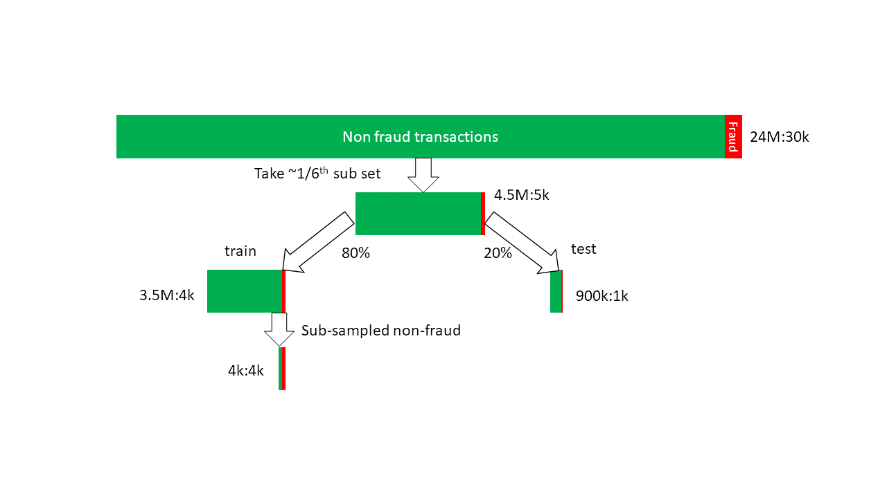
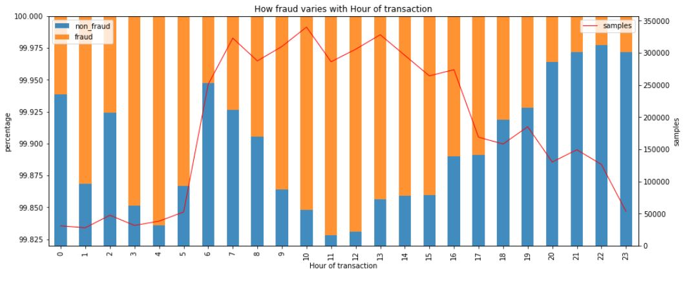
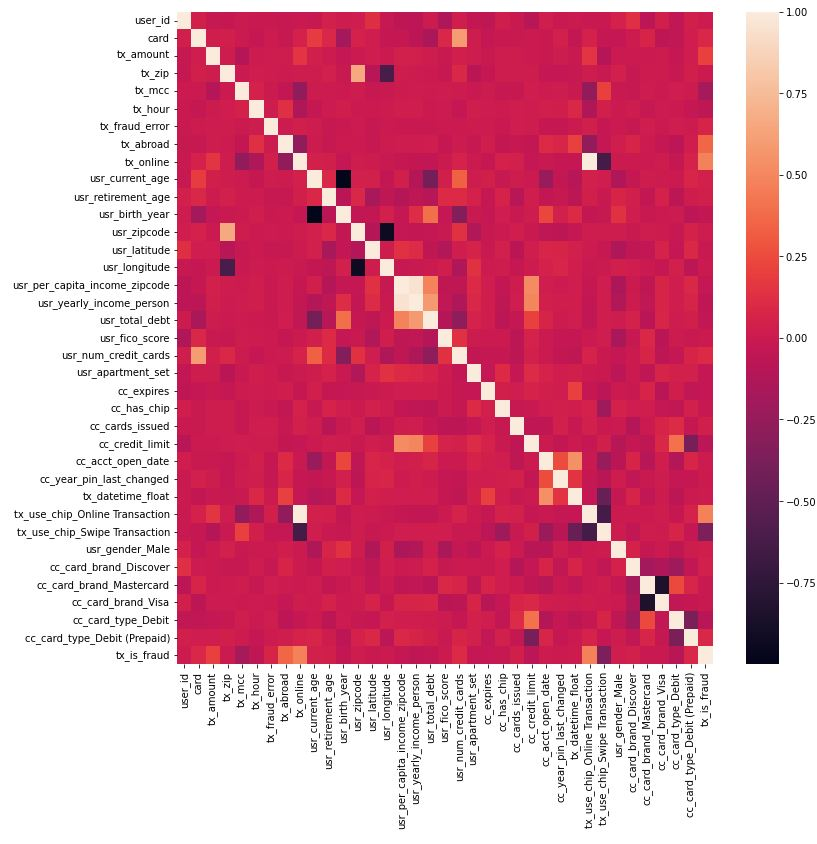
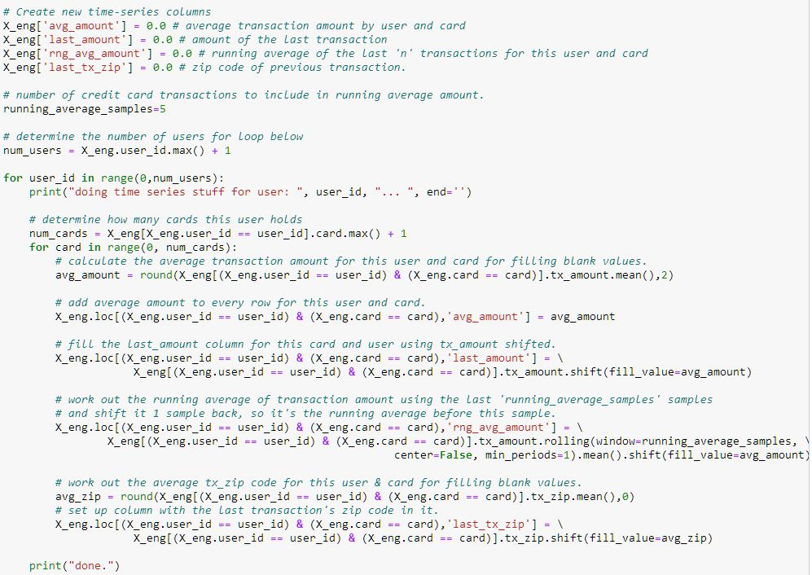
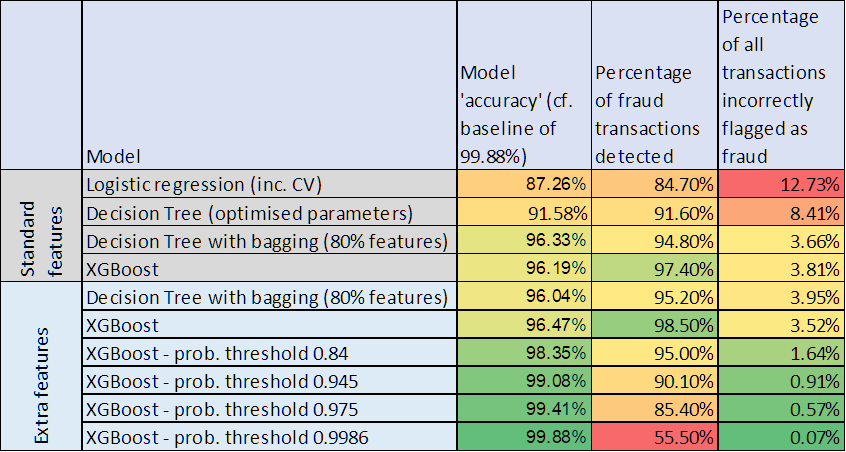
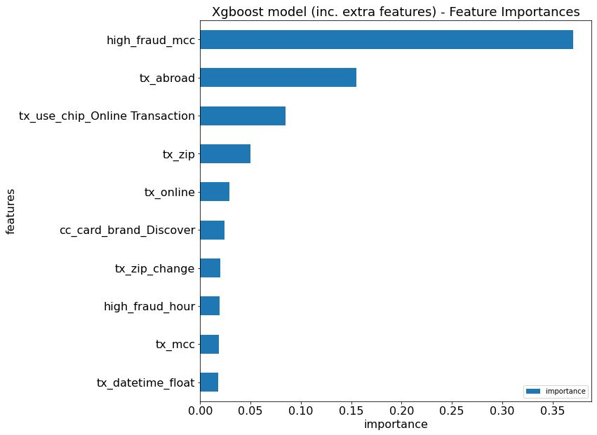

# Credit Card Fraud Detection

## Motivation
This project was completed as part of the General Assembly Data Science Immersive boot camp training course.  The topic of Credit Card Fraud Detection was selected because of a personal interest in fraud detection, particularly in the context of processing high-volume consumer transactions.

## Repository files
This repository contains 4 notebooks:-
- "Data merging and cleaning":  code for loading data from 3 files, cleaning and merging, ready for use through the rest of the project.
- "EDA - Credit Card Fraud Prediction":  Exploratory data analysis.
- "Models based on standard data":  Fraud predictor models based on the features contained in the data.
- "Models based on engineered features":  Fraud predictor models based on features contained in the data plus features added in this notebook.

The repository also contains a Python code file, "jh_eda_classes.py" which includes a few standard EDA functions I have built into a class to save time by re-using them from project to project.

The data files are not stored here due to their size, but the data set is available on Kaggle, here -> https://www.kaggle.com/datasets/ealtman2019/credit-card-transactions

## Technology and tools used

- Pandas
- NumPy
- Scikit-learn
- Imbalanced Learn
- Matplotlib
- Seaborn
- SQLite
- XGBoost

## Background

Credit card fraud is when your credit card is stolen and used to make fraudulent purchases.  Increasingly such fraud takes place electronically, i.e. your card details or electronic "signature" are mined and then used without the card being physically stolen or presented at stores.  The fraudster can operate entirely remotely and use your card to pay for services or have goods delivered to pick-up points like Amazon lockers.

Credit card fraud impacts on consumers and credit-card companies.  For consumers it can mean your card is stopped so you can't use it until it's replaced.  For credit card companies, they may have to pay the cost of the fraudulent transactions and/or pay the cost of extra measures or back office processes needed to mitigate fraud.

## Project aims

The aim of this project was to build a predictor for credit card fraud, utilising the details of an individual transaction, along with the card and card-holder's specifics.  The predictor should therefore predict whether an individual transaction is fraudulent (or not).

The secondary aim of the project was to use Exploratory Data Analysis to gain insights into the kinds of transactions, credit cards, or users which are more prone to fraud.

## Success measures

Primarily I wanted to be able to assess the effectiveness of my classifier.  I therefore used typical classifier metrics, such as precision and recall, to compare results.  AUROC (area-under the receiver-operating characteristic graph) was also a useful measure and one which some models could be trained to maximise.

Additionally I wanted to look at the performance of the classifier from a business-suitability perspective, i.e.:-
- What proportion of the fraud cases in the data set did the classifier detect? (This is actually equivalent to recall).
- What proportion of non-fraud cases did the classifier incorrectly flag as fraud?

The former relates to the cost of undetected fraud, while the latter relates to the cost of any unnecessary intervention on non-fraudulent transactions. 

## Data set

The data set used contains over 24 million card transactions relating to 2000 US-based card users and spanning a period of 25 years (1995-2020). It is simulated data, but has been created (by IBM) for the purpose of building machine-learning algorithms to detect fraud. It contains 3 files:-

- Transactions: id of the customer and card, information about the vendor, the date, time and value of the transaction, etc.
- Users: Credit-card company customer data, including demographic information, address, credit scoring, etc.
- Cards: Credit-card details including type and brand of card, security features, etc. The data can be "joined" together using each user's unique id and the credit card numbers.

The transactions contain almost 30,000 fraud cases (just over 0.1%).  As such there is therefore a massive class imbalance between fraud and non-fraud cases, and this will need to be addressed when training machine-learning models.

## Data preparation

A subset (approximately one sixth) of the transaction data was used for this project due to the limited hardware available.  The data subset contained 5000 fraud transactions out of around 4.5M.  The complete data for 373 out of the 2000 card users was taken to achieve this.  So a complete transaction history for those 373 users was retained, maintaining the validity of any aggregating, relative or windowing functions applied to the data later on (see engineered features).

Data cleaning work included:
- Filling null values in Zip codes and US states for online and overseas transactions.
- Filling null values in an "error code" field which actually indicated there was no error.
- Correctly encoding date and datetime fields.
- Converting currency amounts into numeric fields.
- Converting "Yes/No" flags to binary for modelling purposes.
- Renaming columns for clarity and ease of use.

The 3 data files containing user, card and transaction information were joined together using the user id and card number fields.

The data was then split 80:20 into training and test data sets respectively.

One-hot encoding was used to convert some categorical data fields into binary variables for modelling.

All data was scaled according to the standard distributions of each variable.

### Dealing with class imbalance

A key stage of data preparation was to subsample the non-fraud transactions in the training data set to achieve a 50:50 class balance.

However, note that 99.88% of the transactions in the test set were non-fraud and so this represented the **"baseline"** against which model accuracy was assessed.

## Exploratory Data Analysis (EDA)

The most important aspect of EDA was looking at how fraud varied across the distributions of each feature.  I formulated a consistent approach to doing this across categorical and continuous variables.  For both I created stacked bar charts.  For categoric variables each bar matches to a category.  For continuous variables, the categories were formed by creating histogram bins.  The stacked bars were made up of the percentages of fraud and non-fraud transactions in that category/bin.  Over the top I plotted a line chart showing the number of samples in each category/bin so I could check by eye that any trend I could see was backed up by a statistically significant number of samples.

Here is an example.  This chart shows how fraud varies by hour of the day.  There is a greater chance of a transaction being fraudulent during the early hours of the morning or through the middle of the day.  Note how the left-hand scale starts at close to 100%.  That is because we are looking for relative differences in a very small proportion of transactions which are fraud.

Other factors which make a transaction more likely to be fraudulent:-
- If it takes place online
- If it takes place abroad
- If it relates to certain types of retailers, particularly those onboard cruise liners, and music shops.  (This information is contained in a field called "Merchant Category Code").
- The value of the transaction - fraudulent transactions are bigger, averaging nearly \\$109 versus \\$44 for a non-fraud transaction.
- The age of the credit-card user - older users are more vulnerable.
- The annual income of the credit-card user.  Those on lower income are more vulnerable.
- The type of card.  Prepaid debit cards are most vulnerable and the Discover brand is more vulnerable than Amex, Visa and Mastercard.

### Data correlations

Data correlations were reviewed by reference to heat maps.  Here's a picture showing the heat map of the standard data features.  The bottom row of the heatmap is the target variable, "tx_is_fraud".  As well as seeing many of the correlations observed in the EDA, some collinearity in the data is also evident and consequently some of these variables are "tuned out" by the models.

## Feature engineering

Extra features were engineered into the data set to improve classifier performance.  These fell into 2 categories:
- Features which utilise information from previous transactions to put the next in context.  For example, a running average of the last 5 transaction amounts which the current transaction amount can be compared to.  (See below code snippet).
- Features indicating high-fraud-rate values in categorical variables, e.g. "high_fraud_hour" which is set to "1" if the transaction took place in an hour of the day with above average rate of fraud.

## Modelling

Modelling was carried out in 3 phases:-
1) Building models which used just the "standard" features available in the data.
2) Taking the best two models from the first phase and re-applying them with the data augmented with the extra features engineered into the data.
3) Taking the best model from the second phase and adjusting the probabilistic threshold at which a transaction is flagged as fraud.  

The third phase was carried out to achieve an accuracy score on par with the baseline and to see what implications this had on classifier performance.

The models used were:-
- Logistic Regression model with cross validation (5 splits).
- Decision Tree classifier, using grid search and cross validation to optimise parameters.
- Decision Tree with Bagging (using 80% of samples and features for each tree in the ensemble).
- XGBoost classifier utilising AUROC applied to the test set to trigger early stopping.

## Results

Phase 1 (models using "standard" features showed that the Decision Tree with Bagging and XGBoost models produced significantly better results than the other 2 models.  There was little to choose between the best 2.  XGBoost captured more of the fraud cases (better recall), but flagged slightly more of the non-fraud cases as fraud (more false positives).  XGBoost in fact returned a perfect score on the training set.

Phase 2 demonstrated that the extra features engineered into the training set were worthwhile, improving recall and reducing false positives.  A look at feature importance of the top 10 features used in the XGBoost model for this phase shows the extra features appearing too (high_fraud_mcc, high_fraud_hour, tx_zip_change).  Note also that features found here match up nicely with the results of the EDA.

At this point, the best recall is an impressive 98.5%, however the best model is still generating about 3.5% of false positives.

So onto phase 3 - shifting the probability threshold.  By increasing the threshold at which a transaction is flagged as fraud, we can reduce false positives, in turn increasing accuracy.  However, in the process the recall decreases.

## Conclusions

I have built a classifier to detect 98.5% of fraudulent transactions in my test data set.  My classifier does this at the expense of falsely flagging around 3.5% of all transactions as fraud.  I can reduce these false positives, but at the cost of reducing the detection rate (recall).

In a real-world context, there is a business trade off to make.  Each fraud transaction costs ~\\$109.   There would also be a business cost for each false positive too.  Presumably for such transactions there would be a back-office check to do, or perhaps the customer would be contacted, etc.  Smart companies now use extra validation steps on "high risk" transactions, such as asking the customer to approve the transaction on a smart-phone app, or entering a number sent in a text message.  This keeps the cost of such "false positives" to a minimum.

Being able to adjust the probability threshold at which a transaction is called fraud enables the ideal trade-off point to be set.

A final thought is that in cases like this where a high level of class imbalance exists, accuracy is not a great way of assessing model performance.  The model with the best recall score here has an accuracy of 96.5% which is still under the baseline of 99.88%.  However, it's still an incredibly useful model because it correctly detects 98.5% of the fraud cases and only generates 3.5% of false positives.  This is more valuable than, for example, a model which finds no fraud cases at all, but which would still have an accuracy of 99.88%.

## Limitations

The project was based on simulated (rather than "real") data.  Finding good quality data in this space can be an issue for obvious reasons.  Many of the freely available data sets are obfuscated and/or subjected to PCA.

I worked with a subset of data due to the limited hardware I had available for the project.  I would like to use a larger data set, possibly moving into the cloud to do so.

## Further work

More engineered features could be built to improve the accuracy of the classifier.  Prior to doing that I would try to analyse the false-positives to see if any particular features or characteristics are driving mis-classification.  More work could also be done to improve the performance of the models used, and also to try other types of model (e.g. State-Vector Machine).

## Key learnings/challenges

The project was a great vehicle for cementing and extending the skills learnt on my Data Science boot camp course.  Dealing with class imbalance in my data set was a particular challenge, as was working with Pandas' windowing and shifting functions in an appropriate way with the data set.  I also learnt that XGBoost can be a potent model to use in similar circumstances.
